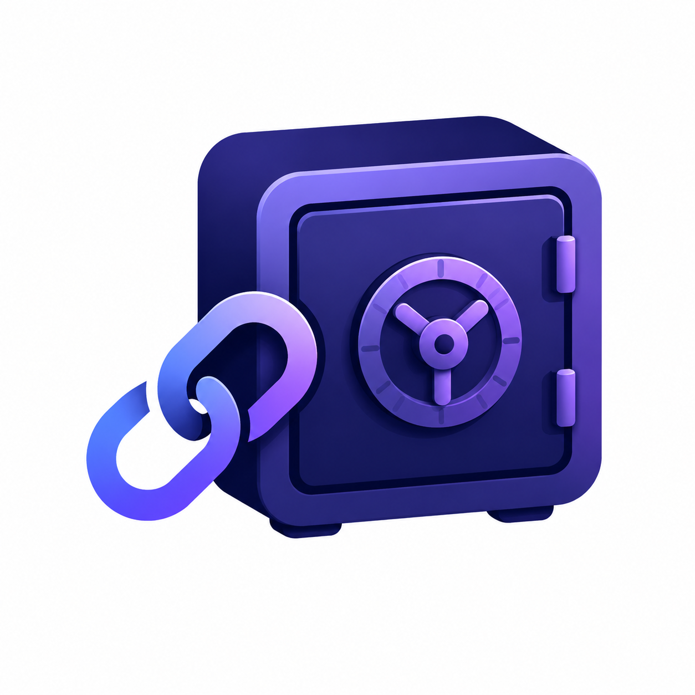

# 🛡️ LinkVault – Job Hunt Link Saver

<p align="center">
  
</p>

<p align="center">
  <strong>Your job-hunt link arsenal. Instantly save, copy, and insert your job application links with context menus and keyboard shortcuts.</strong>
</p>

---

## ✨ Features

- **📂 Categorized Link Management**: Organize your links into **Job Sites**, **Social Links**, **Repositories**, and **Others** to keep your application assets structured.
- **⚡ Keyboard Shortcuts (Alt + 1-9)**: When the popup is active, press `Alt` plus any digit from `1` to `9` to instantly copy that link to your clipboard.
- **🖱️ Insert via Context Menu**: Right-click on any input field, hover over **Insert Link via LinkVault**, navigate categories, and click to automatically insert your link without manual copying/pasting.
- **⌨️ Global Extension Shortcut**: Press `Alt + Shift + L` to open the popup at any time.
- **🌓 Dynamic Dark Mode**: Sleek Material-inspired dark/light theme toggle.
- **🔍 Smart Job Form Detection**: Auto-detects job application forms in the background.

---

## 🛠️ Local Development & Setup

Follow these simple steps to build and run LinkVault locally.

### Prerequisites

Make sure you have [Node.js](https://nodejs.org/) (v18 or higher) and `npm` installed.

### 1. Install Dependencies

Clone or navigate to the project directory and run:

```bash
npm install
```

### 2. Run Development Server (Popup Web UI Preview)

To run and preview the popup layout inside your local browser:

```bash
npm run dev
```

### 3. Build the Extension

Compile the React + TypeScript app and background scripts into the production bundle required for Chrome:

```bash
npm run build
```

This compiles your codebase and assets into the `dist/` directory.

---

## 🧩 Installing the Extension in Chrome

Since LinkVault is in local development and not yet published on the Chrome Web Store, you can load it as an **unpacked extension**:

1. Open Google Chrome and navigate to:

   ```text
   chrome://extensions/
   ```

2. In the top-right corner, toggle the **Developer mode** switch to **ON**.
3. In the top-left, click the **Load unpacked** button.
4. Select the **`dist`** folder inside your project directory (`d:\Project\Link Saver Extension\link-saver-extension\dist`).
5. LinkVault will now be loaded in your browser and visible in your extensions list! Pin it for quick access.

---

## 🚀 How to Use

### Managing Links

1. Click the LinkVault icon (or press `Alt + Shift + L`).
2. Fill in the **Label**, **URL**, and select a **Category** in the top form, then click **Add Link**.
3. Your links will appear categorized in tabs below.

### Quick Copying

- Click the **Copy** button on any link card, or press `Alt + <index>` (e.g., `Alt+1` for the first link) to instantly copy.

### Direct Text Fields Insertion

1. Go to any job application or edit form.
2. **Right-click** on any input box or text area.
3. Select **Insert Link via LinkVault** -> `<Category>` -> `<Your Link>`.
4. The link will be directly inserted at your cursor position!

---

## 🧰 Tech Stack

- **Framework**: [React 19](https://react.dev/) + [TypeScript](https://www.typescriptlang.org/)
- **Build Tool**: [Vite 8](https://vite.dev/)
- **Styles**: Tailwind CSS with modern custom properties and Material Design design system tokens.
- **Chrome Extension Platform**: Manifest V3
